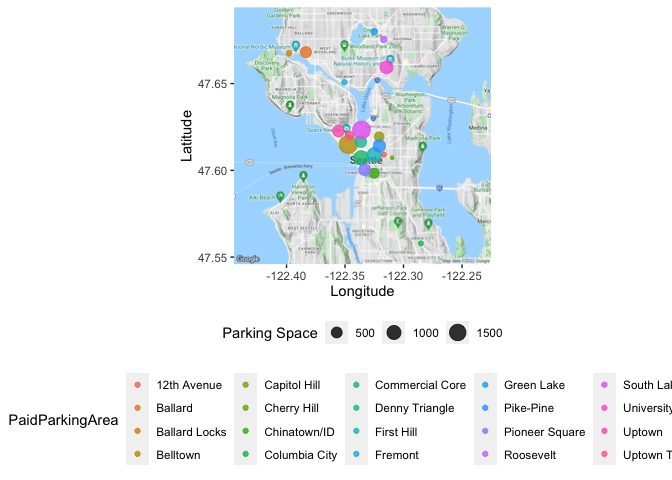
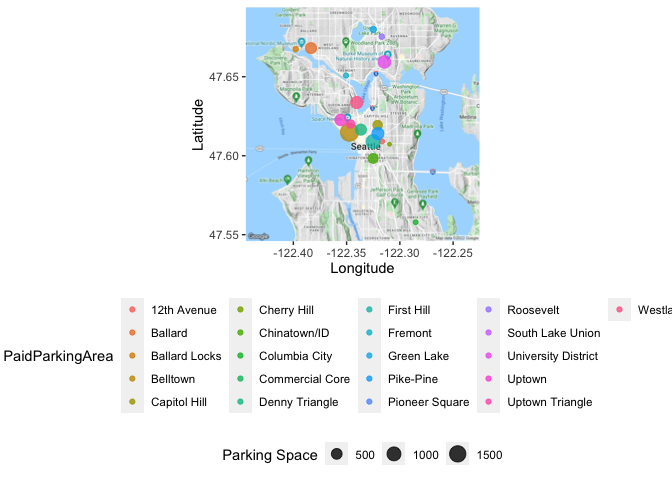

Seattle_Parking
================

``` r
mapdata <- ggmap(get_googlemap(center = c(lon = -122.335167, lat = 47.620013),
                         zoom = 12, scale = 2,
                         maptype ='terrain',
                         color = 'color'))
```

    ## Source : https://maps.googleapis.com/maps/api/staticmap?center=47.620013,-122.335167&zoom=12&size=640x640&scale=2&maptype=terrain&key=xxx

``` r
url <- 'https://raw.githubusercontent.com/kwangyul/IE7275_Project/main/data/'

df_2018 <- read.csv(paste0(url, 2018, '_ParkingLot.csv'))
df_2019 <- read_csv(paste0(url, 2019, '_ParkingLot.csv'), show_col_types = FALSE)
df_2020 <- read_csv(paste0(url, 2020, '_ParkingLot.csv'), show_col_types = FALSE)
```

``` r
mapdata + 
  geom_point(
    aes(x = -long, y = lat,  color = PaidParkingArea, size = `Parking Space`), 
    data = df_2018 %>% group_by(PaidParkingArea) %>%
  summarise(n = n(),
            `Parking Space` = sum(ParkingSpaceCount),
            lat = mean(latitude),
            long = mean(longitude), .groups='drop') , alpha=0.8) + 
  xlab('Longitude') +
  ylab('Latitude') +
  theme(legend.box='vertical', legend.position="bottom")
```

<!-- -->

``` r
mapdata + 
  geom_point(
    aes(x = -long, y = lat,  color = PaidParkingArea, size = `Parking Space`), 
    data = df_2019 %>% group_by(PaidParkingArea) %>%
  summarise(n = n(),
            `Parking Space` = sum(ParkingSpaceCount),
            lat = mean(latitude),
            long = mean(longitude), .groups='drop') , alpha=0.8) + 
  xlab('Longitude') +
  ylab('Latitude') +
  theme(legend.box='vertical', legend.position="bottom")
```

    ## Warning: Removed 3 rows containing missing values (geom_point).

<!-- -->

``` r
mapdata + 
  geom_point(
    aes(x = -long, y = lat,  color = PaidParkingArea, size = `Parking Space`), 
    data = df_2020 %>% group_by(PaidParkingArea) %>%
  summarise(n = n(),
            `Parking Space` = sum(ParkingSpaceCount),
            lat = mean(latitude),
            long = mean(longitude), .groups='drop') , alpha=0.8) + 
  xlab('Longitude') +
  ylab('Latitude') +
  theme(legend.box='vertical', legend.position="bottom")
```

<!-- -->
