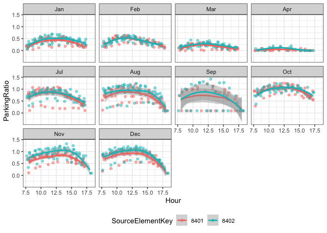
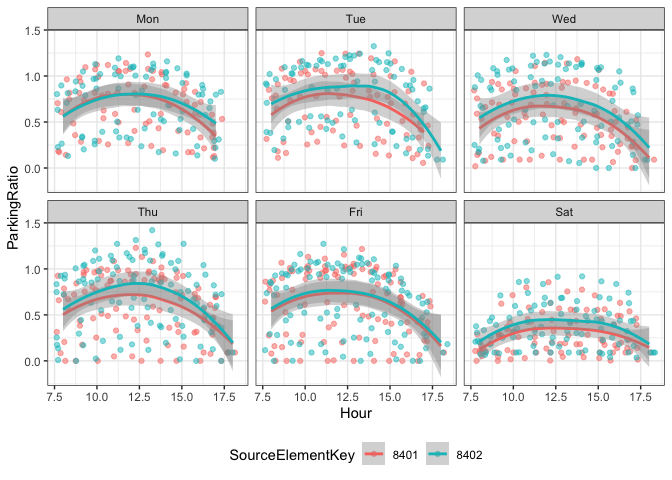
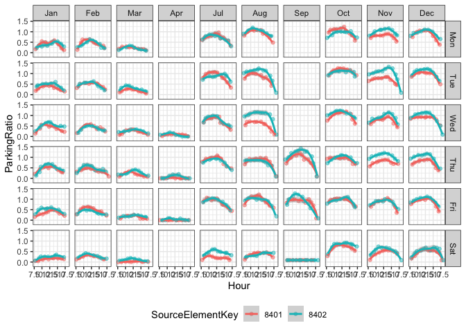
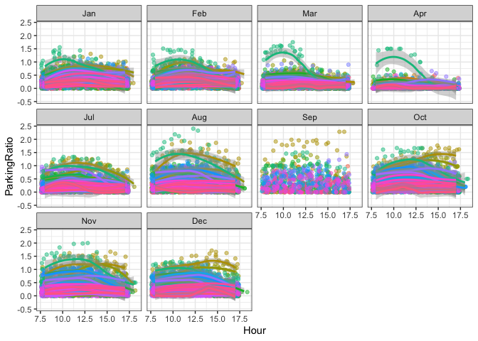
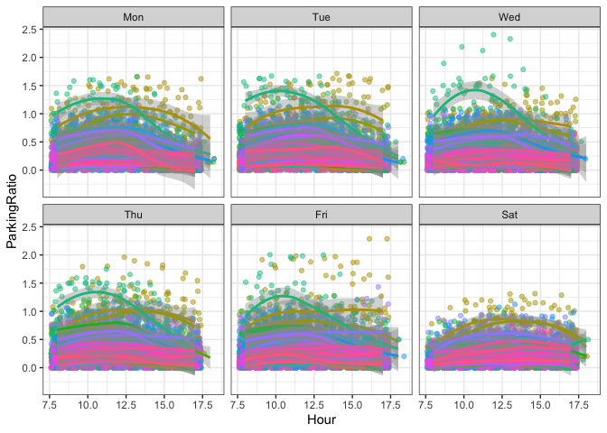

ParkingStat - South Lake Union (2020)
================

# Read parking data about South Lake Union in 2020.

``` r
df <- read_csv("data/2020_ParkingStat_SouthLakeUnion_Group.csv", show_col_types = F)
df$SourceElementKey <- as.character(df$SourceElementKey)
df$Month <- factor(month.abb[df$Month], level = month.abb)
.level_weekday <- c("Sun", "Mon", "Tue", "Wed", "Thu", "Fri", "Sat")
df$Weekday <- factor(.level_weekday[df$Weekday], level = .level_weekday)
```

# Exploratory data analysis

## Source element key in 8401, 8402.

| SourceElementKey | Blockface Name                                   | Side of Street |
|------------------|--------------------------------------------------|----------------|
| 8401             | 8TH AVE N BETWEEN REPUBLICAN ST AND MERCER SR ST | W              |
| 8402             | 8TH AVE N BETWEEN REPUBLICAN ST AND MERCER SR ST | E              |

### Facet data by Month

``` r
df %>%
  filter(SourceElementKey %in% c(8401, 8402)) %>%
  ggplot(aes(
    x = Hour,
    y = ParkingRatio,
    color = SourceElementKey
  )) +
  geom_jitter(alpha = 0.5) +
  geom_smooth() +
  facet_wrap(~Month) +
  theme_bw() +
  theme(legend.position="bottom")
```

    ## `geom_smooth()` using method = 'loess' and formula 'y ~ x'

<!-- -->

### Facet data by Weekday

``` r
df %>%
  filter(SourceElementKey %in% c(8401, 8402)) %>%
  ggplot(aes(
    x = Hour,
    y = ParkingRatio,
    color = SourceElementKey
  )) +
  geom_jitter(alpha = 0.5) +
  geom_smooth() +
  facet_wrap(~Weekday) +
  theme_bw() +
  theme(legend.position="bottom")
```

    ## `geom_smooth()` using method = 'loess' and formula 'y ~ x'

<!-- -->

### Facet data by Month and Weekday

``` r
df %>%
  filter(SourceElementKey %in% c(8401, 8402)) %>%
  ggplot(aes(
    x = Hour,
    y = ParkingRatio,
    color = SourceElementKey
  )) +
  geom_jitter(alpha = 0.5) +
  geom_smooth() +
  facet_grid(Weekday ~ Month) +
  theme_bw() +
  theme(legend.position="bottom")
```

    ## `geom_smooth()` using method = 'loess' and formula 'y ~ x'

<!-- -->

## Source element key started number 1.

### Facet data by Month

``` r
df %>%
  filter(str_detect(SourceElementKey, "^1")) %>%
  ggplot(aes(
    x = Hour,
    y = ParkingRatio,
    color = SourceElementKey
  )) +
  geom_jitter(alpha = 0.5) +
  geom_smooth() +
  facet_wrap(~Month) +
  theme_bw() +
  theme(legend.position = "none")
```

    ## `geom_smooth()` using method = 'loess' and formula 'y ~ x'

    ## Warning in simpleLoess(y, x, w, span, degree = degree, parametric =
    ## parametric, : span too small. fewer data values than degrees of freedom.

    ## Warning in simpleLoess(y, x, w, span, degree = degree, parametric =
    ## parametric, : at 10.99

    ## Warning in simpleLoess(y, x, w, span, degree = degree, parametric =
    ## parametric, : radius 0.0001

    ## Warning in simpleLoess(y, x, w, span, degree = degree, parametric =
    ## parametric, : all data on boundary of neighborhood. make span bigger

    ## Warning in simpleLoess(y, x, w, span, degree = degree, parametric =
    ## parametric, : pseudoinverse used at 10.99

    ## Warning in simpleLoess(y, x, w, span, degree = degree, parametric =
    ## parametric, : neighborhood radius 0.01

    ## Warning in simpleLoess(y, x, w, span, degree = degree, parametric =
    ## parametric, : reciprocal condition number 1

    ## Warning in simpleLoess(y, x, w, span, degree = degree, parametric =
    ## parametric, : at 13.01

    ## Warning in simpleLoess(y, x, w, span, degree = degree, parametric =
    ## parametric, : radius 0.0001

    ## Warning in simpleLoess(y, x, w, span, degree = degree, parametric =
    ## parametric, : all data on boundary of neighborhood. make span bigger

    ## Warning in simpleLoess(y, x, w, span, degree = degree, parametric =
    ## parametric, : There are other near singularities as well. 0.0001

    ## Warning in simpleLoess(y, x, w, span, degree = degree, parametric =
    ## parametric, : zero-width neighborhood. make span bigger

    ## Warning in simpleLoess(y, x, w, span, degree = degree, parametric =
    ## parametric, : zero-width neighborhood. make span bigger

    ## Warning: Computation failed in `stat_smooth()`:
    ## NA/NaN/Inf in foreign function call (arg 5)

<!-- -->

### Facet data by Weekday

``` r
df %>%
  filter(str_detect(SourceElementKey, "^1")) %>%
  ggplot(aes(
    x = Hour,
    y = ParkingRatio,
    color = SourceElementKey
  )) +
  geom_jitter(alpha = 0.5) +
  geom_smooth() +
  facet_wrap(~Weekday) +
  theme_bw() +
  theme(legend.position = "none")
```

    ## `geom_smooth()` using method = 'loess' and formula 'y ~ x'

<!-- -->
